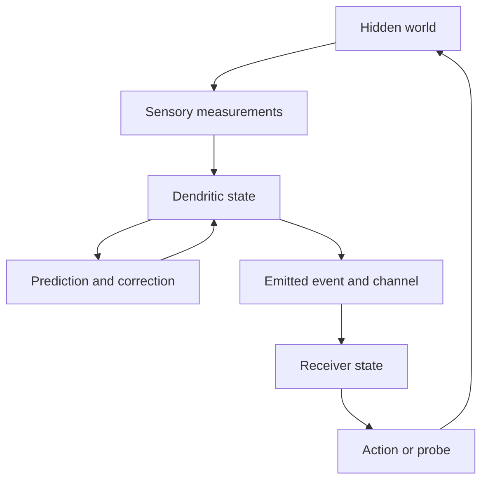

# History, emitted state, and the brain as an inverse modeler

*Research note, 30 September 2026. Developed from Antti Luode's Deerskin idea and the discussion of accidental instruments, Takens embeddings, and state-dependent neural signals.*

## 1. The question that becomes concrete

A hidden system changes. An observer receives a restricted stream of consequences. The observer's own dynamics retain and transform that stream. Can its current internal state become an informative representation of the hidden system?

That question connects the wall experiment to the neuron idea without requiring a metaphor to do the mathematical work. In computational periscopy, an occluder makes different hidden sources leave distinguishable patterns on a visible wall [1]. In temporal state reconstruction, history can make different hidden states leave distinguishable trajectories in an observer.

The additional possibility raised by the waveform paper is that the observer also emits a signal whose shape depends on the state it has reached [2]. Another observer may receive part of the history-shaped state through that emission.

The full hypothesis has four parts:

1. Temporal sensory structure drives a diverse dendritic state.
2. That state preserves distinctions needed to infer the relevant hidden process.
3. The emitted signal makes some of those distinctions accessible downstream.
4. Coupling, prediction, correction, and action organize many such local states into a useful model of the environment.

Each part is independently measurable. A convincing result at the first part would not establish the fourth. This separation gives the larger idea a route to evidence.

## 2. History can turn a narrow observation into state coordinates

Let a deterministic system have hidden state $s_t$ and evolution $s_{t+1}=f(s_t)$. A sensor reports $y_t=h(s_t)$. A single $y_t$ can be compatible with several states. A history vector

$$
\mathbf d_t=(y_t,y_{t-\tau},\ldots,y_{t-(m-1)\tau})
$$

can distinguish them. Takens' classical result establishes an embedding for generic smooth observations and dynamics under its finite-dimensional, compact-manifold and invertibility assumptions; the classical construction uses $2d+1$ coordinates for a $d$-dimensional manifold [3].

Here an embedding means that distinct states remain distinct and that the representation has a smooth inverse on its image. It provides alternative coordinates for the dynamics, with no requirement that those coordinates resemble a physical photograph or preserve ordinary distances. It does not identify unique physical machinery from observations.

A pendulum makes the intuition visible. The same horizontal position can occur while it moves in opposite directions. Recent position history separates those cases. The sensory stream supplies information about velocity through its development over time.

The practical question is whether the observer's actual state preserves such distinctions at the noise level and timescale that matter. A decorative three-dimensional plot is insufficient. Hidden-variable recovery, future prediction, and explicit searches for confused states are better measurements.

## 3. A dendrite could implement a history coordinate through its physics

Literal delayed copies are one construction. A branch can instead retain a filtered history:

$$
r_i(t)=\int_0^\infty k_i(\tau)y(t-\tau)\,d\tau,
\qquad \mathbf r(t)=(r_1(t),\ldots,r_m(t)).
$$

The kernels might differ in decay, phase, input location, and effective bandwidth. This equation is a linear approximation; active conductances introduce additional state and nonlinear responses. Cable dynamics describe possible physical machinery for these coordinates. Embedding describes their possible computational role.

Biological branches receive different mixtures of inputs. The scalar filter bank is a simplified case. An experiment must specify which underlying process drives those inputs; treating every synapse as a delayed copy of the same sensor would otherwise assume the desired correspondence.

Reservoir-embedding theory supplies a direct mathematical connection. Grigoryeva, Hart and Ortega establish suitable linear reservoir embeddings under hypotheses including sufficient dimension, generic observations, stability/smoothness conditions, and restrictions on the underlying dynamics [4]. Thus filtered history can support state reconstruction. That theorem does not guarantee that a particular cable tree, hand-chosen resonator bank, or biological neuron satisfies its conditions.

There is biological evidence for a necessary ingredient: cortical dendrites can discriminate the order and velocity of synaptic activation, with sequence sensitivity reaching somatic depolarization and spike output. Branco, Clark and Häusser demonstrated this using controlled glutamate uncaging [5]. It establishes temporal processing, while reconstruction of an external state is a further proposed computation.

Diversity alone is insufficient. Nearly identical filters yield redundant coordinates. Excessively rapid decay loses relevant history; excessive smoothing can merge different trajectories. Growth would help only if it creates useful, accessible distinctions. More branches and more modes are not themselves success criteria.

## 4. The original Deerskin code exposes the readout problem

The inspected `takens_gated_deerskin.py` builds a delay matrix, projects each vector against a cosine template, squares the projection, and averages it through a temporal gate [R1]. This is a concrete frequency-recognition mechanism.

Writing its essential readout as

$$
q(\mathbf d)=(\mathbf w^\top\mathbf d)^2
$$

shows a particular information loss: $q(\mathbf d)=q(-\mathbf d)$. The final time average removes further temporal distinctions. Frequency recognition can benefit from this invariance. Recovering the original state may require distinctions that it deliberately merges.

Consequently the soma question is not merely whether it mixes the branches. It is which distinctions remain accessible after that mixing, and on what observation window.

Several routes deserve examination: a population of readouts; an informative somatic trajectory; context-dependent readout; or late probes that elicit different responses from the same retained state. A scalar time series can itself support reconstruction if it is an informative observable. A single instantaneous scalar or trial-average score offers much less access.

There is also a distinction between preserving information and making it convenient to use. Two invertibly related coordinate systems preserve the same information, but a constrained reader can perform very differently on them. A retrieval advantage from a coordinate change should be measured separately from a gain in recoverable state.

## 5. What the waveform paper adds

The attached preprint is *Action potential waveforms are state-dependent*, by Blanca Martin-Burgos, Ashley Juavinett, Pamela D. Rivière, Ryan Hammonds and Bradley Voytek. The supplied version is posted 21 September 2026 and is not peer reviewed [2].

Its useful contribution here is evidence that emitted waveform features can be informative about the conditions producing the event. The paper analyzes intracellular waveforms, where spikes can be attributed to the recorded neuron, together with controlled-current or paired extracellular measurements.

| Reported finding | Relevance to this hypothesis | Boundary of the evidence |
|---|---|---|
| Waveform features classify constant, ramp and pink-noise stimulation at 78.4% reported spike-level cross-validation accuracy | Output shape can distinguish input conditions | This classification used one cell with adequate trials; it is not a general decoder across neurons |
| Waveform features relate to statistics of recent injected current, with some informative windows extending to 500 ms | A brief event can carry a signature of earlier conditions | Recovering input statistics is different from reconstructing the whole input history |
| Within-cell waveform variability is structured and often multimodal | A neuron's output should not automatically be replaced by a fixed template in this investigation | Multimodality does not identify a memory code or a world-state coordinate |
| Waveform features predict local field-potential amplitude and variability beyond a log-ISI-only control | The event can reflect aspects of surrounding local activity | Effects are heterogeneous and modest; the reported median amplitude CV $R^2$ is 0.034, and spectral targets lack a significant population-level effect |

The last row is particularly relevant to the user's idea of brain-wide state, but the evidence is local. It does not reconstruct a common global brain state. A log-ISI control also does not exclude every possible rate or firing-history explanation.

The defensible step is: **a spike waveform may be an additional partial observation of the state that produced it**. A downstream neuron making use of that observation is a separate hypothesis.

Regenerative, threshold-like spike occurrence and variability in waveform shape can coexist. State-dependent waveforms do not require abandoning the physical mechanisms of spike generation.

## 6. Two observability questions must survive the whole pathway

The first question is about the world-to-neuron mapping:

$$
s_t\longrightarrow y_{\leq t}\longrightarrow\mathbf r_t.
$$

Do world states requiring different future predictions remain distinguishable in the neuron's state?

The second question is about the neuron-to-receiver mapping:

$$
\mathbf r_t\longrightarrow m_i(t)\longrightarrow u_j(t)\longrightarrow z_j(t).
$$

Does a useful distinction survive emission, transmission, synaptic conversion, and reception? A marked-event description makes the proposed channel explicit:

$$
m_i(t)=\sum_k w_i\!\left(t-t_{ik};\eta_i(t_{ik})\right),
$$

where $t_{ik}$ are event times, $w_i$ is the waveform, and $\eta_i$ is a subset or function of the sender's state. The receiver is driven by a transformed signal,

$$
u_j(t)=\sum_i\mathcal T_{ij}[m_i](t),
\qquad \dot z_j=F_j(z_j,u_j),
$$

where $\mathcal T_{ij}$ includes axonal and synaptic effects. These are modeling definitions, not equations fitted to the attached study.

The receiver need not measure the same waveform an intracellular electrode sees at the soma. Propagation can transform it; a synapse may convert a shape difference into a release difference or erase it. Primary experiments by Geiger and Jonas provide one relevant causal example: activity-dependent presynaptic spike broadening increased calcium inflow and evoked postsynaptic currents at mossy-fiber synapses [6]. This supports a possible downstream effect of waveform shape, without establishing a general communication alphabet.

Some of the attached paper's informative features include the pre-spike ramp and voltage around the event. Information available in that electrode window is not automatically part of a transmitted axonal payload. A communication test must evaluate what survives at the terminal and in the postsynaptic response, rather than handing the receiver the full recorded feature vector.

FridayRepo already explores an engineered version of the interaction: a sender-history-dependent shape meets a receiver-history-dependent susceptibility [R2]. Its planted task demonstrates narrow computational sufficiency. It does not establish that biological neurons implement that protocol.

This is the important connection: a neuron may receive a state-shaped consequence of another neuron's history, and the effect of that consequence can depend on the receiver's own history. Both sides of the connection are dynamical.

## 7. What a brain-wide state could mean

For a network, define its physical state schematically as

$$
Z_t=(z_{1,t},\ldots,z_{N,t},\theta_t),
$$

where $z_i$ include rapidly changing local variables and $\theta$ includes slower plastic parameters. Emitted events expose partial functions of this distributed state.

That definition alone explains no cognition: every physical dynamical network has state. The meaningful question is whether accessible parts of $Z_t$ predict the environment, integrate evidence across sensors, and support useful action.

A distributed inverse model need not put the complete world into every cell. Different subsystems could retain overlapping, complementary coordinates. Coupling could make their estimates compatible. This would have to be shown through improved joint inference, preserved distinctions, and causal effects of communication.

It also need not be a single synchronous snapshot. Delays, local clocks, and changing reliability make coordination part of the problem. Multiple local states becoming correlated is insufficient: a common drive can produce correlation without one system communicating a useful estimate to another.

The biological waveform finding makes partial state-dependent emission plausible. The stronger brain-wide interpretation requires demonstrating that these emissions contribute to a distributed representation, beyond timing, rate, shared drive and ordinary recurrent dynamics.

## 8. From reconstructed geometry to a world model

Suppose a representation $E$ embeds the relevant autonomous hidden dynamics. In those coordinates the corresponding transition is

$$
G=E\circ f\circ E^{-1}.
$$

A practical observer must approximate the transition and connect it back to observations. One proposed update is

$$
\widehat{\mathbf r}_{t+1}=G_\theta(\mathbf r_t,a_t),\qquad
\widehat y_{t+1}=D_\theta(\widehat{\mathbf r}_{t+1}),
$$

$$
\epsilon_{t+1}=y_{t+1}-\widehat y_{t+1},\qquad
\mathbf r_{t+1}=C_\theta(\widehat{\mathbf r}_{t+1},\epsilon_{t+1}).
$$

Here $a_t$ records an action or controlled probe, $D$ predicts the sensory consequence, and $C$ corrects the state using new evidence. These equations specify a family of observer designs; they do not assert a particular cortical implementation.

This separates three learning problems: forming useful coordinates, learning their transition, and learning how to read or communicate them. A sensory next-step predictor can exploit a shortcut while failing to preserve a state variable needed for another task. Occlusion forecasts and questions chosen after the history are therefore important tests.

An acting animal also changes its measurement process. A changing retinal signal can arise from object motion, eye motion, or both. Actions and sensor pose must be accounted for. In a noisy, partially observable environment, a distribution over plausible states may be more appropriate than a unique reconstructed point. The autonomous Takens theorem does not directly settle those cases.

There is also a useful goal below full physical-state reconstruction: retain distinctions that change predictions under relevant actions and queries. A representation can merge two different histories if every permitted future test treats them alike. Predictive state representations explicitly describe controlled, stochastic systems through predictions of future observations [7]. This established precedent helps frame a practical brain model: its coordinates could describe possible sensory consequences and actions without uniquely recovering physical anatomy. If a new question separates previously merged histories, that compression has reached its limit.

## 9. The strongest lesson from Varjoluotain

The inspected transport code constructs a matrix $A$ relating a hidden screen to wall illumination. The occluder gives different sources different spatial responses. The solver combines measurement fit, non-negativity and a total-variation prior. The ledger examines modes of the background-cancelled operator and constructs approximately indistinguishable scenes [R3].

The spatial instrument and the proposed temporal instrument have a useful correspondence:

| Wall reconstruction | Proposed neural observer |
|---|---|
| Hidden screen | Hidden dynamical state |
| Distinct shadow patterns | Distinct responses to sensory histories |
| Transport matrix | History-to-state mapping and accessible readout |
| Weak measurement modes | Hidden distinctions merged by filtering or emission |
| Smoothness prior | Learned expectations about plausible states |
| New plate position or mask | New action, gate or probe |

The correspondence is operational. It does not imply a shared biological mechanism or an AdS/CFT duality.

The repository's mode counts are defined for a selected scene-change amplitude, noise convention and geometry. They are useful diagnostics within that setup, not universal certificates of recoverability. Noise, nuisance parameters, and the relevant class of scenes matter.

An especially instructive reported result is the plate-location failure on real photographs. The search succeeded on simulations, but with the tested model it selected incorrect locations on real images and worsened reconstruction. For BU, the stored result reports correlation falling from 0.643 with the published geometry to 0.186 with the located geometry. The README discusses room-light mismatch and weak localization directions.

This is directly relevant to the brain idea. A model can explain its measured output while inferring the wrong hidden causes. A realistic-looking internal scene, or a small prediction residue, is not enough. The observer must retain uncertainty over competing explanations and face measurements or interventions that separate them.

The occluder does not create information from nothing. It changes which source differences the physical measurement makes accessible. A temporal bank likewise gains access to earlier observations and organizes their information. Priors can choose among unresolved possibilities; they cannot make those possibilities measured facts.

## 10. Luotain becomes an account of distinguishability

Luotain's useful connection is its treatment of hypotheses through probe responses [R4]. For this proposal, ask which different worlds the current observer still treats alike.

For a finite probe set $\mathcal Q$, define a response fingerprint

$$
\Phi_{\mathcal Q}(s)=\bigl(\rho(s,q_1),\ldots,\rho(s,q_K)\bigr).
$$

If two candidate states have indistinguishable fingerprints at the measurement noise level, keep them as unresolved alternatives. A new probe is valuable when it separates alternatives relevant to the decision. Finite probes establish distinguishability within the tested model class, not complete equivalence of arbitrary systems.

This gives learned susceptibility a purpose beyond recognition. Histories can prepare states whose responses expose different hidden possibilities. A probe selected only after the history tests whether the state supports several questions, rather than merely storing an answer to one predictable question.

The word residue needs two precise uses here. A **prediction residue** is a mismatch between observation and prediction. An **unresolved residue** is the remaining set of hypotheses or distinctions that the measurements cannot settle. A small first residue can coexist with a large second one.

## 11. How the repositories contribute

| Repository | Relevant mechanism or question | Claim this note does not inherit |
|---|---|---|
| Geometric-Neuron [R1] | Explicit history coordinates, template projection and gated readout | Frequency classification proves hidden-world reconstruction |
| ResonaattoriAivo [R5] | Resonator history, an explicit clock, prediction and error-driven learning | Resonance alone explains tempo transfer, or the model already reconstructs a general world |
| FridayRepo [R2] | Sender waveform interacting with receiver susceptibility; late-query controls | A planted waveform interaction establishes a biological code |
| PredictiveSusceptibility [R6] | History-dependent response measured against a sham | Every history-dependent response is an external-state estimate |
| Varjoluotain [R3] | A concrete physical forward model, inversion, ambiguity diagnostics and model mismatch | Synthetic reconstruction performance transfers unchanged to reality |
| Luotain [R4] | Probe fingerprints, counterexamples and an unresolved remainder | A finite fingerprint is a universal inverse model |

The common next measurement is **which relevant distinctions survive each stage**. The source mechanisms are promising building blocks; the missing result is end-to-end recovery and use of hidden state.

## 12. Useful consequences worth attempting

**A small observer that develops an extra sense.** A scalar brightness, sound or position trace could support an internal trajectory of a hidden oscillator or moving source. The display should show what the observer receives, its prediction, uncertainty, and the withheld truth.

**A model that continues through brief sensory absence.** If state and transition are adequate, the observer can predict motion or phase while input is occluded. When observations return, correction can reveal both the retained knowledge and the accumulated uncertainty.

**A communication model whose events carry context.** A waveform-shaped event could transmit a useful hidden distinction with the same event times as a control. The meaningful gain is measured after a constrained transmission pathway and in the receiving system, at a matched communication budget.

**A lens that reports its blind spots.** Search for pairs of hidden states that look identical to the observer but require different predictions. These pairs give concrete evidence of a missing coordinate and tell us what additional observation or probe would be useful.

**An observer that helps identify its own instrument.** Filter constants, transmission parameters and sensor pose can themselves be unknown. Learning them jointly with world state is a system-identification problem. Varjoluotain's localization result shows why calibration and model-mismatch tests belong in the demonstration.

**A distributed reconstruction from several partial views.** Two observers receiving complementary streams could exchange state-dependent events and improve joint inference. An improvement after communication is stronger evidence than similar-looking latent trajectories or synchronized activity.

These applications would make the idea visible without requiring a claim about consciousness or complete access to the brain.

## 13. What would count as progress

The companion [experiment protocol](experiments.md) proposes three main stages: hidden-state reconstruction inside the observer, survival through emission and transmission, and useful integration by a receiver. The stages should have separate receipts.

A successful ordinary delay bank is a positive control. An equally sized conventional reservoir tests whether the proposed dendritic organization adds an advantage. The advantage might be robustness, useful readout with less training, adaptation to a timescale, or communication efficiency. Merely reproducing an established reservoir reconstruction is useful calibration but does not establish architectural novelty.

Important tests include the same present observation after different histories, reset and history-shuffle controls, held-out trajectories, unpredictable late queries, physical channel transformations, and states that are unobservable. No future samples may enter the online observer. Hidden labels may be used by a separate evaluation decoder, with disjoint calibration and evaluation data.

The most informative negative result would identify the failure stage: the branch state merges the relevant worlds; the soma erases a distinction; transmission removes it; or the receiver cannot use it. That answer is more useful than an attractive reconstruction without attribution.

## 14. The hypothesis to carry forward

The narrow claim is that a neuron's temporal state may represent relevant hidden dynamics. The waveform evidence raises a second possibility: its emitted event may expose a useful part of that state. Receiver history can determine how the arriving event is interpreted.

If those steps survive measurement, many coupled neurons could support a distributed inverse model whose representations are continuously driven, queried and corrected. The model would reconstruct the distinctions accessible through its sensors and actions, while leaving other worlds unresolved.

The missing result is therefore specific: **show a hidden-world distinction being formed from history, surviving the emitted signal, and changing a receiver's correct prediction or action.**

That would connect the original dendrite idea, the state-shaped ping, and the wall's accidental lens through an observable computation.

## References and source review

### Primary literature

1. Saunders, C., Murray-Bruce, J., and Goyal, V. K. (2019). *Computational periscopy with an ordinary digital camera*. Nature 565, 472-475. [DOI: 10.1038/s41586-018-0868-6](https://doi.org/10.1038/s41586-018-0868-6). [Original code and experimental data](https://github.com/Computational-Periscopy/Ordinary-Camera).
2. Martin-Burgos, B., Juavinett, A., Rivière, P. D., Hammonds, R., and Voytek, B. (2026). *Action potential waveforms are state-dependent*. bioRxiv, supplied version posted 21 September 2026. [DOI: 10.64898/2026.09.15.751814](https://doi.org/10.64898/2026.09.15.751814). [Authors' analysis repository](https://github.com/voytekresearch/spikewise/tree/main/Action%20potential%20waveforms%20are%20state-dependent%20paper). Results and numerical qualifications here were read from the supplied full PDF; the publisher page was not available through the retrieval service.
3. Takens, F. (1981). *Detecting strange attractors in turbulence*. In Dynamical Systems and Turbulence, Warwick 1980, Lecture Notes in Mathematics 898, 366-381. [Original paper scan](https://www.math.ucdavis.edu/~saito/data/synchrosqueezing/takens_detect-strange-attractors-turbulence.pdf).
4. Grigoryeva, L., Hart, A., and Ortega, J.-P. (2023). *Learning strange attractors with reservoir systems*. Nonlinearity 36, 4674-4708. [DOI: 10.1088/1361-6544/ace492](https://doi.org/10.1088/1361-6544/ace492). [Author preprint](https://arxiv.org/abs/2108.05024), especially the linear-reservoir embedding result and its hypotheses.
5. Branco, T., Clark, B. A., and Häusser, M. (2010). *Dendritic discrimination of temporal input sequences in cortical neurons*. Science 329, 1671-1675. [DOI: 10.1126/science.1189664](https://doi.org/10.1126/science.1189664). [Author manuscript](https://pmc.ncbi.nlm.nih.gov/articles/PMC6354899/).
6. Geiger, J. R. P., and Jonas, P. (2000). *Dynamic control of presynaptic Ca2+ inflow by fast-inactivating K+ channels in hippocampal mossy fiber boutons*. Neuron 28, 927-939. [DOI: 10.1016/S0896-6273(00)00164-1](https://doi.org/10.1016/S0896-6273(00)00164-1).
7. Littman, M. L., Sutton, R. S., and Singh, S. (2001). *Predictive representations of state*. Advances in Neural Information Processing Systems 14. [Original proceedings paper](https://proceedings.neurips.cc/paper/2001/file/1e4d36177d71bbb3558e43af9577d70e-Paper.pdf).

### Repository sources

- **[R1] [Geometric-Neuron](https://github.com/anttiluode/Geometric-Neuron):** inspected `takens_gated_deerskin.py`, particularly `embed`, `resonance`, and `score`. Source blob `2b590bd3cb5dafa67f8950ea8a7bf2b474e32480`.
- **[R2] [FridayRepo](https://github.com/anttiluode/FridayRepo):** inspected README, including its engineered task, generic-dynamics qualification, and proposed late-query falsifier. README blob `903a67a007d9a166d0efc527d4e6d91364a99dfc`.
- **[R3] [Varjoluotain](https://github.com/anttiluode/Varjoluotain):** inspected README, `varjoluotain/transport.py`, `solve.py`, `ledger.py`, and `results/real_locate_funnel.json`, plus the supplied browser HTML and screenshot. README blob `6c25199aef7f68bbc846a0b630783182759fc8e4`; repository head observed during review `3021008dbcc914368333b4dc24c1e87d54eacbd2`.
- **[R4] [Luotain](https://github.com/anttiluode/Luotain):** the probe-fingerprint and unresolved-remainder connection draws on the preceding discussion and Varjoluotain's explicit mapping. Its underlying engine was not newly audited for this note.
- **[R5] [ResonaattoriAivo](https://github.com/anttiluode/ResonaattoriAivo):** inspected README and its mechanism/qualification descriptions. README blob `50856f42e4bd5945bb656c33f8e8bc00603e9547`.
- **[R6] [PredictiveSusceptibility](https://github.com/anttiluode/PredictiveSusceptibility):** inspected the README's introduction and sham-controlled probe description. README blob `a8f028d6da5133b3feb996b87c27148d49af6c28`.

Source review date: 30 September 2026. Existing experiments were not rerun. The experiments proposed here have not been executed, and the synthesis is a research hypothesis rather than an established biological mechanism.
